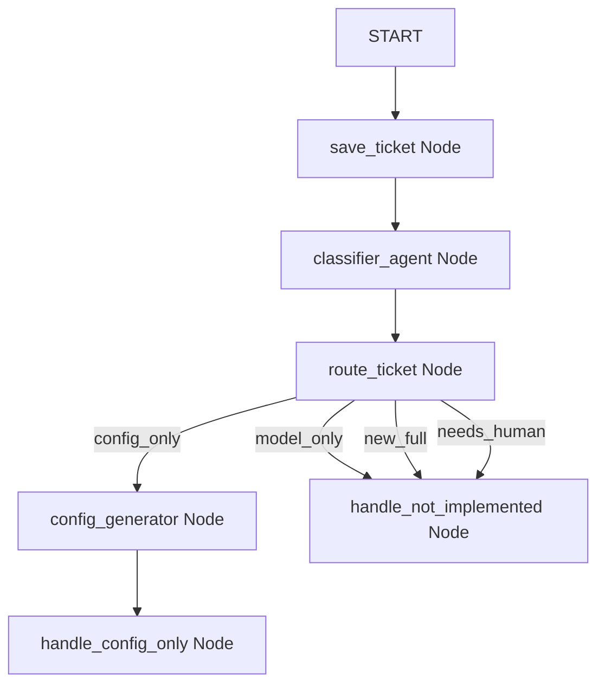

# Design Specification: dbt-factory-agent

This document specifies the design for `dbt-factory-agent`, a data engineering assistant agent built using **ADK 2.0**'s Graph Workflow API. The agent parses Jira tickets and automates the creation of dbt DAG configuration files.

## 1. Local Authentication & Environment

Local authentication uses Google AI Studio. 

### API Key Acquisition
Obtain the API key from the **Google AI Studio** console:
*   URL: [https://aistudio.google.com/](https://aistudio.google.com/)

### Environment Variables
Configure the following in the project's `.env` file:
```bash
# Google AI Studio API Key
GEMINI_API_KEY=YOUR_API_KEY_HERE

# Instruct the SDK to use the developer/consumer endpoint (AI Studio) instead of Vertex AI
GOOGLE_GENAI_USE_ENTERPRISE=FALSE
```

---

## 2. Agent Architecture (Graph Workflow)

The agent is constructed as a `Workflow` (Graph-based agent) instead of the 1.x `SequentialAgent` style. 

### Model Selection
*   **Model**: `gemini-3.1-flash-lite`

### Topology Diagram


---

## 3. Nodes and Schemas

### A. Schemas (Pydantic)

#### 1. `Classification`
Used by the classifier to structure its decision.
```python
from pydantic import BaseModel, Field
from typing import Literal

class Classification(BaseModel):
    category: Literal["config_only", "model_only", "new_full", "needs_human"] = Field(
        description="The classified category of the Jira ticket."
    )
    reason: str = Field(description="The reasoning behind this classification.")
```

#### 2. `DbtConfig`
Used by the config generator to produce a structured dbt DAG configuration.
```python
class DbtConfig(BaseModel):
    dag_name: str = Field(description="Name of the dbt DAG, usually snake_case.")
    schedule: str = Field(description="Cron expression or interval (e.g. '0 2 * * *' or 'daily').")
    models: list[str] = Field(description="List of dbt models to run in this DAG.")
    owner: str = Field(description="Owner/contact email address or team identifier.")
    description: str = Field(description="Brief explanation of what this DAG processes.")
```

### B. Node Definitions

| Node Name | Node Type | Input Type | Output Type | Description / Behavior |
| :--- | :--- | :--- | :--- | :--- |
| `save_ticket` | `FunctionNode` | `types.Content` | `str` | Extracts the raw string from the user prompt (`START` node input) and saves it to state under `ctx.state['ticket_text']`. |
| `classifier_agent` | `LlmAgent` | `str` | `dict` (Classification) | Uses the LLM to classify the ticket text into one of the four categories according to the `Classification` Pydantic model. |
| `route_ticket` | `FunctionNode` | `dict` | `dict` (Classification) | Inspects the classification result and returns an `Event` with the matching `route` (the category name). |
| `config_generator` | `LlmAgent` | `dict` | `dict` (DbtConfig) | Runs in the `config_only` route. Injects `{ticket_text}` from state into its prompt and generates the structured dbt config using `DbtConfig` schema. |
| `handle_config_only` | `FunctionNode` | `dict` (DbtConfig) | `dict` | Writes the generated config dictionary to `config.json` in the current working directory, and yields a user-facing success event with the serialized JSON. |
| `handle_not_implemented` | `FunctionNode` | `dict` | `str` | Handles `model_only`, `new_full`, and `needs_human` routes. Yields a "not implemented yet" message and ends. |

---

## 4. Execution Flow & User Interaction

1.  The workflow starts with `START` receiving the Jira ticket text.
2.  `save_ticket` runs, saving the text.
3.  `classifier_agent` classifies the input.
4.  `route_ticket` routes the flow.
5.  If routed to `config_only`:
    *   `config_generator` generates the config.
    *   `handle_config_only` writes it to `config.json` and reports success.
6.  For other routes:
    *   `handle_not_implemented` reports "not implemented yet" and terminates.
