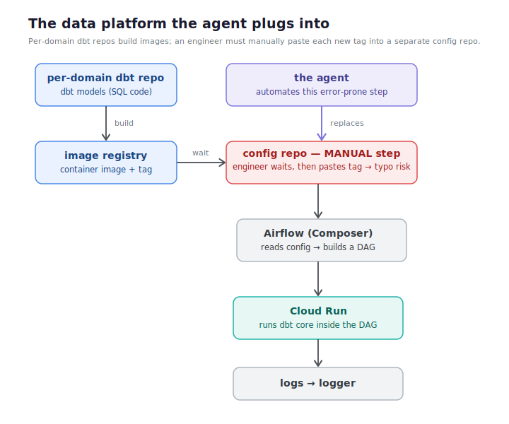
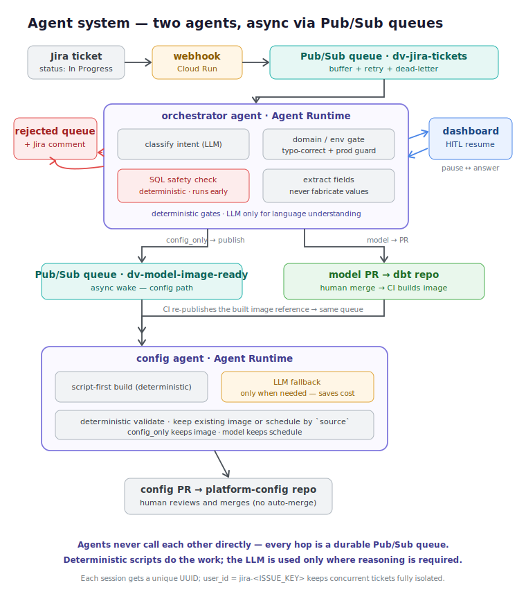

# dbt-factory-agent

**A framework that turns a plain-English Jira ticket into a reviewed, PR-ready dbt pipeline change — no human writes the config or the boilerplate SQL.**

This is the **orchestrator** agent in a two-agent, event-driven system that automates the last mile of analytics-engineering work: reading a ticket, deciding what kind of change it describes, generating the code or config, running deterministic safety checks, and opening a pull request for a human to merge.

It is deliberately built as a **framework for dynamic code and config generation**, not a one-off script: the same pipeline turns arbitrary tickets into the right artifact (a config change *or* a new dbt model) and plugs into an existing dbt/Airflow/Cloud Run platform without hard-coding any single pipeline.

---

## 1. The problem

Data-mesh style organizations grow relentlessly. Every new domain, metric, schedule change, or pipeline tweak means more repositories, more DAGs, and more configuration to maintain. As the system grows:

- **Headcount has to grow with it.** More pipelines means more engineers just to keep the lights on — most of their time spent on mechanical transcription, not judgment.
- **Maintenance gets harder.** The surface area of things that can drift, break, or fall out of sync expands faster than the team.
- **Mistakes are expensive.** A typo'd domain name, a missing schedule, a service account pasted into the wrong environment, or the wrong image tag copied into a config file can cost hours of debugging to track down — and the failure often surfaces far downstream, long after the mistake was made.

Concretely, on the platform this agent plugs into (see the diagram below), each domain has its own dbt repository that builds a **container image**. A **separate config repository** holds one `config.json` per DAG. Today, after an image is built, an engineer has to **wait for the build, then manually paste the new image tag into that config file** — a slow, error-prone handoff where a single wrong tag produces a broken pipeline. Airflow (Composer) then reads the config, builds a DAG, and Cloud Run runs dbt core inside that DAG, writing logs to a logger.



That manual, error-prone config step in the middle is exactly what this agent removes. Everything around it — the dbt repos, the image registry, Airflow, Cloud Run, the logger — stays as-is. This project is **one sample of the kind of toil an agent framework like this can absorb**; the same architecture generalizes to the rest of the platform's repetitive change requests.

## 2. Why agents

This isn't a single prompt-to-code call — it's a **multi-agent system**, because the task genuinely requires several different kinds of reasoning chained together, with **deterministic guardrails between every step**:

- **Free-text understanding** — Jira tickets are unstructured prose. An LLM classifies intent (config change? model change? too vague to act on?) and extracts structured fields from it.
- **Gating, not guessing** — the agent is explicitly instructed to *never* invent identity/security values (service accounts, project IDs) or environment/domain names. If a ticket doesn't say it, the agent asks a human or rejects the ticket rather than fabricating a plausible-looking value.
- **Code generation under constraints** — SQL and config are drafted by an LLM, then verified by deterministic, non-LLM checks before anything leaves the sandbox.
- **Human-in-the-loop, not human-in-the-way** — the workflow pauses mid-execution (via ADK's resumable `RequestInput`) to ask a targeted question — "did you mean `sports`?", "what cron schedule?" — and resumes exactly where it left off once a human (or a dashboard click) answers.
- **PR creation, not auto-merge** — every generated change lands as a pull request with an LLM-written "Vibe Diff" summary (what changed, risk level, intent alignment), so a human still reviews and merges.

## 3. Architecture overview



The system is **two independently deployed [Google ADK](https://google.github.io/adk-docs/) graph-workflow agents connected by Pub/Sub**, plus two small FastAPI services for ingestion and human review:

- **`dbt-factory-agent` (this repo, the orchestrator)** — receives ticket text, classifies it, validates domain/environment, and either (a) hands a config-only change off to the config-agent, or (b) generates the dbt model itself and opens a PR directly.
- **`dv-config-agent`** — a second ADK agent, woken by Pub/Sub, that owns everything related to `config.json` / `deploy.yml` and opens PRs against the platform config repo.
- **Jira webhook** (`jira_webhook/`) — a minimal FastAPI service on Cloud Run that turns a Jira "issue updated" event into the first Pub/Sub message.
- **Manager dashboard** (`manager_dashboard/`) — a FastAPI service on Cloud Run that surfaces every paused agent session (open questions the agent needs answered) and lets a human resolve them without touching Jira or the CLI.

### Async by design: why Pub/Sub, not direct calls

The two agents **never call each other directly** — every hop between them is a durable **Pub/Sub queue**. This was a deliberate architectural decision. An earlier local prototype wired the agents together as a direct agent-to-agent (A2A) call, which works on a laptop but is the wrong shape in production: a synchronous call couples the two services' lifecycles, blocks the caller while the callee works, and breaks whenever either agent is redeployed. In practice we wanted the interaction to be **asynchronous**, so we moved every inter-agent handoff onto Pub/Sub.

Treating Pub/Sub as a **queue** buys a lot for free:

- **Decoupling** — either agent can be redeployed, scaled, or replaced independently; the queue holds the message until the consumer is ready.
- **Buffering + retry** — spikes are absorbed, transient failures are retried automatically.
- **Reliability** — each subscription has a **dead-letter topic**, so a message that repeatedly fails is captured rather than lost.

### The two ticket paths

1. **`config_only`** — the ticket only asks for configuration changes (schedule, tables, metadata). The orchestrator extracts the intent fields, validates them, and **publishes an event** for the config-agent to act on. No model code is touched.
2. **`model_only`** — the ticket asks for new/changed dbt SQL. The orchestrator generates the SQL + `_schema.yml` itself, runs it through a deterministic SQL-safety gate, pushes it to a feature branch in the dbt project repo, and opens a PR — then, once CI builds the image, the same config queue is used to update the deployed image reference too.

Tickets that are ambiguous, target production, or reference an unknown domain/environment (and can't be typo-corrected) are routed to a `needs_human` queue instead of being guessed at.

### Event-driven transport

Everything between the two agents and the surrounding repos moves over Pub/Sub topics in a single GCP project. Each is a durable queue with a dead-letter topic:

| Topic | Publisher | Purpose |
|---|---|---|
| `dv-jira-tickets` | Jira webhook | New/updated ticket text, wrapped as an Agent Runtime `stream_query` envelope with `user_id: jira-<ISSUE_KEY>` |
| `dv-model-image-ready` | Orchestrator (config_only path) **and** the dbt repo's CI (after a model PR merges and its image is built) | Wakes `dv-config-agent` to create/update a DAG's `config.json` + `deploy.yml` |
| `dv-rejected-tickets` | Orchestrator (any rejection path) | A structured, auditable record of why a ticket was declined |

### The CI/CD loop

For `model_only` tickets, the loop closes across repos with no manual step: the orchestrator pushes generated SQL to a feature branch and opens a PR → once a human merges it to `main`, the dbt repo's GitHub Actions workflow builds and pushes a Docker image → on that same push, CI **re-publishes to `dv-model-image-ready` with the freshly built image reference** → `dv-config-agent` picks it up and opens a second PR against the platform config repo updating the deployed image. A ticket becomes a running pipeline change **without anyone hand-editing a deploy manifest or pasting an image tag** — the exact manual step from §1, gone.

### Multi-user session isolation

Every ticket runs in its own isolated Agent Runtime session. The webhook omits any fixed session id, so Agent Runtime mints a **unique UUID session per call**, and the `user_id: jira-<ISSUE_KEY>` convention makes each run traceable. Two engineers moving two different tickets to *In Progress* at the same moment get two fully independent runs with no shared state — and that same `user_id` convention is what lets a rejection later post a comment back onto the *correct* Jira issue.

### Human-in-the-loop (Manager Dashboard)

When the workflow needs an answer it can't derive (an unresolved domain/environment typo, a missing cron schedule for a brand-new DAG), it raises an ADK `RequestInput` interrupt and **pauses** — the session is fully resumable, not discarded. The Manager Dashboard lists all paused sessions, and lets a human **approve, reject, or type a free-text answer**, which is sent back to the paused session via the Reasoning Engine's `stream_query` API to resume exactly where it stopped.

### Rejected-tickets flow

Every rejection (invalid domain, invalid environment, unsafe SQL) is published to `dv-rejected-tickets` for audit/analytics, and — if the ticket originated from Jira — the orchestrator also **posts a comment on the original issue** explaining exactly why it was declined, so the reporter isn't left guessing.

### Reviewable by design: the "Vibe Diff"

A real, under-discussed cost in data platforms is that **reviewing a change is often harder than writing it**. When code (or config) is generated for you, it's tempting to approve it without fully understanding it — and over time engineers lose touch with the structure of their own system, until even a small incident needs an AI just to explain what is running and why. That erodes, rather than builds, the team's knowledge.

This system is deliberately designed to push the other way. Every change the agent proposes arrives as a pull request carrying a structured **"Vibe Diff"** written by the agent, containing:

- **A plain-English summary** of what the change actually does, in the context of the project.
- **A risk level** (low / medium / high) with a one-line reason.
- **An intent-alignment note** — how well the generated change matches what the ticket actually asked for.
- **A security statement** — for model PRs, an explicit confirmation that the SQL was deterministically verified to be SELECT-only.

The goal is not to replace the reviewer but to **make the reviewer faster and better-informed**: the Vibe Diff explains the change, surfaces its risk up front, and shows the engineer the shape of the change rather than just a raw diff. Because a human still merges every PR, the loop *transfers* knowledge and structure to the team instead of hollowing it out — the agent does the mechanical work, while the engineer keeps ownership, context, and the final decision.

## 4. Key features / concepts demonstrated

- **Multi-agent ADK system** — two separately deployable `Workflow` (graph) agents built on ADK 2.0, communicating over Pub/Sub rather than direct calls; each can be redeployed, scaled, or replaced independently.
- **Deployability** — scaffolded and deployed with `agents-cli` to **Agent Runtime** (Vertex AI Reasoning Engine); the two supporting services (Jira webhook, Manager Dashboard) run as lightweight **Cloud Run** FastAPI apps; secrets come from **Secret Manager**, never from code.
- **Deterministic-first, LLM-only-where-needed** — the design principle throughout: **deterministic scripts do the work; the LLM is used only where genuine reasoning is required** (understanding prose, drafting SQL, summarizing a PR). This is both a *safety* choice (deterministic checks can't be prompt-injected) and a *cost* choice — the config-agent, for example, builds config in plain code and only falls back to the LLM for the rare non-standard case, avoiding an LLM call on every run.
- **Security, defense in depth:**
  - *Pre-commit secret scanning* — a local `pre-commit` hook runs custom Semgrep rules that block any commit containing a hardcoded credential (Google/Gemini API keys, GitHub classic and fine-grained tokens), so secrets can't leave the workstation — a local backstop complementing the primary controls (secrets live only in a gitignored `.env` for dev and Secret Manager in deployment).
  - *Two-layer SQL safety* — a deterministic (non-LLM) guard rejects any generated SQL containing `DROP`, `DELETE`, `TRUNCATE`, `ALTER`, `GRANT`, `INSERT`, `UPDATE`, or `CREATE [OR REPLACE]`, run once immediately after generation (fail fast) and again immediately before the git push (defense in depth). The LLM is *also* instructed to emit SELECT-only — so the model would have to both ignore its instructions *and* defeat a deterministic regex to do harm.
  - *Production guard* — this system only ever writes non-production config; any ticket targeting `prod`/`production`/`live` is routed straight to a human, in both agents.
  - *Anti-fabrication* — prompts explicitly forbid inventing service accounts, project IDs, or environment/domain names; missing values are asked for or the ticket is rejected, never guessed.
  - *Git workspace isolation* — all git operations happen inside a `tempfile.TemporaryDirectory`, only ever push to a new `feature/*` branch, and land as a PR; nothing is written to `main` directly, and the temp clone is wiped even on failure.
  - *Rejection transparency* — declines are never silent; they're published for audit and, where possible, commented back to the source ticket.
- **Agents CLI** — the project was scaffolded, evaluated, and deployed with the Agents CLI end to end (`agents-cli deploy` to Agent Runtime).
- **Transport decision (MCP evaluated)** — an Atlassian **MCP** server was evaluated as the Jira integration point, but a Pub/Sub-backed webhook was chosen instead: it needs no long-lived connection or session state, survives agent redeploys, and keeps the Jira-facing surface to a single small, independently deployable endpoint.

## 5. Design decisions & honest limitations

A few choices were made deliberately, and are worth calling out rather than hiding:

- **The model-generation agent is intentionally simple.** The `model_only` path generates straightforward SELECT-only dbt models. It could be made considerably more capable (multi-file models, ref/source graph awareness, incremental materializations, tests). For this project it was **kept simple on purpose**, so the focus stays on the *architecture* — the multi-agent event-driven design, the safety model, the deploy story — rather than on maximizing raw code-generation cleverness. Making the model agent smarter is the most natural line of future work.
- **No auto-merge, by design.** The agent's job ends at a reviewed PR. A human always merges. This keeps a person in control of what actually reaches the platform.
- **Non-production only.** The production guard is a hard stop, not a warning. Extending safely to production would be a separate, deliberate piece of work.

## 6. Repo map

| Repo | Role |
|---|---|
| **`dbt-factory-agent`** (this repo) | The orchestrator agent, plus the Jira webhook and Manager Dashboard services. |
| **`dv-config-agent`** | The config-agent: turns a validated intent payload into a `config.json`/`deploy.yml` PR against the platform config repo. |
| **`dv-sports-etl`** | A sample dbt project (models + schema). Receives `model_only` PRs from the orchestrator; its GitHub Actions workflow builds/pushes the Docker image and re-triggers the config-agent on merge to `main`. |
| **`dv-platform-config`** | The GitOps config repo — non-production dbt DAG configs organized per `<environment>/<domain>/<dag-name>/`. The target of every config-agent PR. |

Two more diagrams document the internal decision flow of each agent:

- Orchestrator flow: [`docs/03-orchestrator-flow.svg`](docs/03-orchestrator-flow.svg)
- Config-agent flow: [`docs/04-config-agent-flow.svg`](docs/04-config-agent-flow.svg)

## 7. Setup / reproduce

### Prerequisites

- [`uv`](https://docs.astral.sh/uv/getting-started/installation/) — Python package manager
- [`agents-cli`](https://google.github.io/adk-docs/) — Google Agents CLI
- Google Cloud SDK, authenticated against a project with Vertex AI, Pub/Sub, and (if deploying) Cloud Run enabled

### Environment variables

None of these are committed — set them in a local, gitignored `.env` for development, and as Secret Manager–backed env vars in deployment. **Names only — never commit values.**

| Variable | Used by | Purpose |
|---|---|---|
| `GEMINI_API_KEY` | orchestrator, config-agent | Gemini API key (local dev / runtime) |
| `GITHUB_TOKEN` | orchestrator, config-agent | Authenticates git pushes and PR creation |
| `JIRA_API_TOKEN` | orchestrator | Posts rejection comments back to Jira |
| `JIRA_EMAIL` | orchestrator | Basic-auth identity for the Jira REST API |
| `JIRA_BASE_URL` | orchestrator | Base URL of the Jira site |
| `GOOGLE_CLOUD_PROJECT` | all services | Target GCP project (Pub/Sub, Vertex AI) |
| `GOOGLE_CLOUD_LOCATION` | orchestrator, config-agent | Set to `global` for Gemini model routing |

### Run locally

```bash
# install dependencies
uv sync

# run the agent locally with the Agents CLI playground
agents-cli playground
```

Contributors: run `uv run pre-commit install` once to activate the local secret-scanning hook.

The Jira webhook and Manager Dashboard are standalone FastAPI apps and can be run directly for local testing:

```bash
uv run uvicorn jira_webhook.main:app --reload --port 8080
uv run uvicorn manager_dashboard.main:app --reload --port 8081
```

### Deploy

```bash
gcloud config set project <your-gcp-project-id>

# deploy the orchestrator to Agent Runtime (europe-west1)
agents-cli deploy \
  --project <your-gcp-project-id> \
  --region europe-west1 \
  --secrets "GITHUB_TOKEN=GITHUB_TOKEN,GEMINI_API_KEY=GEMINI_API_KEY,JIRA_API_TOKEN=JIRA_API_TOKEN" \
  --update-env-vars "GOOGLE_CLOUD_LOCATION=global"
```

`dv-config-agent` is deployed the same way, independently. The Jira webhook and Manager Dashboard ship as Cloud Run services (each has its own `Procfile`/`Dockerfile`). Pub/Sub topics and push subscriptions wire the pieces together; each topic has a dead-letter topic for reliability.

## 8. Security note

No secrets, API keys, or tokens are committed to this repository. All credentials (`GEMINI_API_KEY`, `GITHUB_TOKEN`, `JIRA_API_TOKEN`, `JIRA_EMAIL`) are supplied at runtime via environment variables backed by **Secret Manager** in deployed environments, or a local, gitignored `.env` file during development. The two-layer SQL safety check, the production guard, the anti-fabrication rules, and the tempfile-isolated feature-branch-only git flow together ensure the agent cannot write destructive SQL, touch production, invent credentials, or push to a protected branch.
